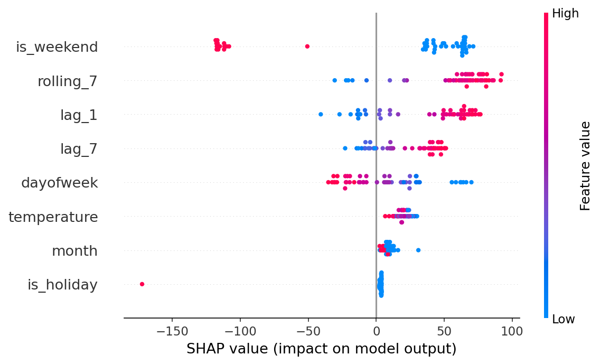
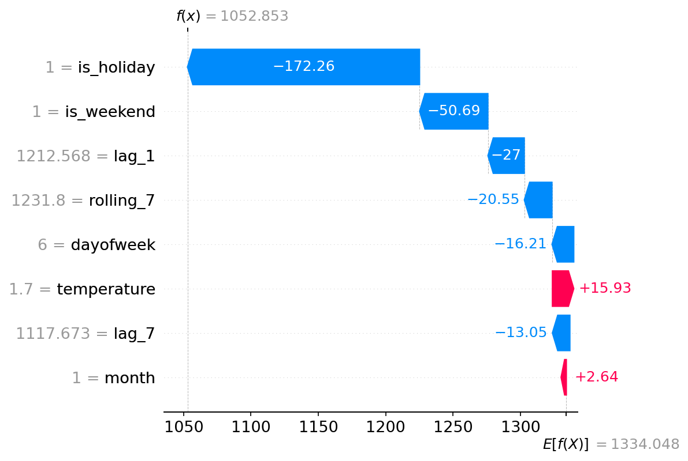

# Energy Consumption Forecaster

Forecasts daily electricity consumption for Germany. The pipeline fetches live grid load from SMARD (Bundesnetzagentur) and weather data from Open-Meteo, then builds features from lags, holidays, calendar effects, and temperature interactions. KNN and MLP models train on over 7,300 days of historical data and serve predictions through a FastAPI endpoint. Each prediction includes SHAP and LIME explanations. A plausibility module flags statistical outliers.

A LangChain/LangGraph agent (ReAct architecture) sits on top of the API and handles natural-language access. Instead of constructing JSON requests, users ask questions in English. The agent fetches current SMARD data, selects the appropriate endpoint, runs model comparisons where relevant, and returns an explained result. It runs on Claude but the LLM backend is swappable.

The forecasting methodology comes from my professional experience building consumption models for a diverse customer portfolio spanning industrial, commercial, public sector, and data center clients. The pipeline automation, explainability layer, and LangChain agent are additions I built for this project.
SMARD + Open-Meteo > feature engineering > KNN / MLP > FastAPI > plausibility check > LangChain agent > SHAP / LIME

## What it does

- Predicts daily consumption via a FastAPI endpoint
- Pulls live grid data from SMARD (Bundesnetzagentur) and weather from Open-Meteo
- Lets you query the forecaster in natural language through a LangChain agent
- Explains individual predictions with SHAP and LIME
- Flags suspicious predictions with automated plausibility checks
- Parses customer notification emails with an LLM agent and adjusts forecasts automatically

## Data

Training combines two sources automatically, no manual download needed:

- **OPSD**: daily consumption 2006-2017 ([open-power-system-data.org](https://open-power-system-data.org))
- **SMARD**: live daily grid load from 2018 onward, fetched via API ([smard.de](https://www.smard.de))

Running `python3 src/train.py` pulls the latest SMARD data, merges it with OPSD, and trains on ~7,300+ rows.

## Models

Trained on 2006-2024, tested on 2025:

| Model | MAE | RMSE |
| --- | --- | --- |
| Day-of-week baseline | 48 GWh | 78 GWh |
| KNN | 24 GWh | 33 GWh |
| MLP | 21 GWh | 31 GWh |

KNN is the production model. Fast to train, near-instant inference, and only slightly behind MLP on accuracy.

### Christmas Day validation (vs actual SMARD data)

| Year | Predicted | Actual | Error | Temp |
| --- | --- | --- | --- | --- |
| 2023 | 1,046 GWh | 1,077 GWh | -2.9% | 9.3°C |
| 2024 | 1,086 GWh | 1,073 GWh | +1.2% | 2.5°C |
| 2025 | 1,083 GWh | 1,160 GWh | -6.6% | -7.1°C |

Under 3% error on 2023 and 2024. The 2025 miss (-6.6%) is a cold-weather edge case: at -7.1°C, heating demand pushed actual consumption ~80 GWh above the model's holiday baseline. I added `holiday_temp` and `weekend_temp` interaction features, which help but don't fully solve it since cold holidays are rare in the training data and get outvoted by mild ones in KNN.

## Email Parsing Agent

I worked with consumption models across a large industrial customer portfolio. When customers notified us of unusual events, planned shutdowns, production increases, factory closures, someone had to manually read the email, interpret it, and adjust the forecast flag. At scale this meant reviewing hundreds of models daily.

I built an agentic pipeline to automate this. It consists of three modules that mirror the Microsoft Power Platform stack:

Customer email
|
[Parser Agent]        -> extracts event type, dates, confidence
|
[Context Store]       -> checks customer history, detects conflicts
|
[Orchestrator]        -> calls /predict with special_event=true
|
Adjusted forecast + plausibility result

### Modules

| Module | File | Microsoft Analog | What it does |
|---|---|---|---|
| Email Parser | `src/agent/parser.py` | AI Builder | Reads raw email, extracts structured event data via LLM |
| Context Store | `src/agent/store.py` | Dataverse | Persists events per customer, detects overlapping events |
| Orchestrator | `src/agent/orchestrator.py` | Copilot Studio | Coordinates all steps, calls forecast API |

### Example

Input email (German):

Betreff: Betriebsunterbrechung März
Wir möchten Sie informieren, dass unser Werk vom 10.03. bis 12.03.
aufgrund von Wartungsarbeiten vollständig abgeschaltet wird.

Output:
```json
{
  "parsed_event": {
    "event_type": "shutdown",
    "start_date": "2025-03-10",
    "end_date": "2025-03-12",
    "confidence": 0.98,
    "special_event": true
  },
  "conflict_warning": null,
  "forecast": {
    "predictions_gwh": { "knn": 1430.39 },
    "plausibility": {
      "special_event_mode": true,
      "warning": "special event flagged - prediction plausibility check suppressed"
    }
  }
}
```

The parser handles German and English emails, calendar week references (KW14), and ambiguous language. Duplicate events for the same customer and date are automatically deduplicated in the context store.

**Stack:** Claude API (swappable to Azure OpenAI), Pydantic, SQLite, httpx

## LangChain Agent

The API expects structured JSON. The LangChain agent sits on top and handles the translation: you ask a question in plain English, it figures out what to call, pulls live data from SMARD, hits the API, and explains the result.

It uses a ReAct agent (LangGraph) with three tools:

- `get_energy_forecast`: calls `/predict` with auto-fetched SMARD lag values
- `compare_models`: runs KNN, MLP, and baseline side by side
- `check_api_health`: pings the API

Example interactions:
You: Yesterday's consumption was 1500 GWh, is that normal for a Tuesday in March?

Agent: That's about 11% above the historical average for March Tuesdays
(~1,350 GWh). Not extreme enough to flag a data issue, but worth
checking. Could be a cold snap driving heating demand, or an
industrial event. Want me to run a forecast using that value?

The agent runs on Claude (Anthropic) via `langchain-anthropic`. You can swap to OpenAI or a local model by changing the LLM initialization in `agent.py`.

## Explainability

SHAP and LIME explanations for the KNN model, generated by `src/explain.py`.

**SHAP beeswarm** (global feature importance across test predictions):



**SHAP waterfall** (single prediction breakdown for New Year's Day):



**LIME** (local surrogate for the same prediction):


```bash
python3 src/explain.py
# outputs: reports/shap_summary.png, reports/shap_waterfall.png, reports/lime_explanation.png
```

## How to run

```bash
# train
pip install -r requirements.txt
python3 src/train.py

# start API
uvicorn src.api:app --reload

# run email parsing agent
export ANTHROPIC_API_KEY=sk-ant-...
PYTHONPATH=. python3 tests/test_orchestrator.py

# start LangChain agent (separate terminal)
pip install -r langchain_agent/requirements-langchain.txt
export ANTHROPIC_API_KEY=sk-ant-...
cd langchain_agent && python3 agent.py
```

## Stack

Python, Pandas, Scikit-learn, FastAPI, SHAP, LIME, LangChain, LangGraph, Claude API, Pydantic, SQLite, httpx, Open-Meteo API, SMARD API, Docker

## Next steps

- Holiday-aware plausibility thresholds
- RAG over energy docs for contextual Q&A
- Drift monitoring and automated retraining via GitHub Actions
- Swap Claude API to Azure OpenAI endpoint for enterprise deployment
